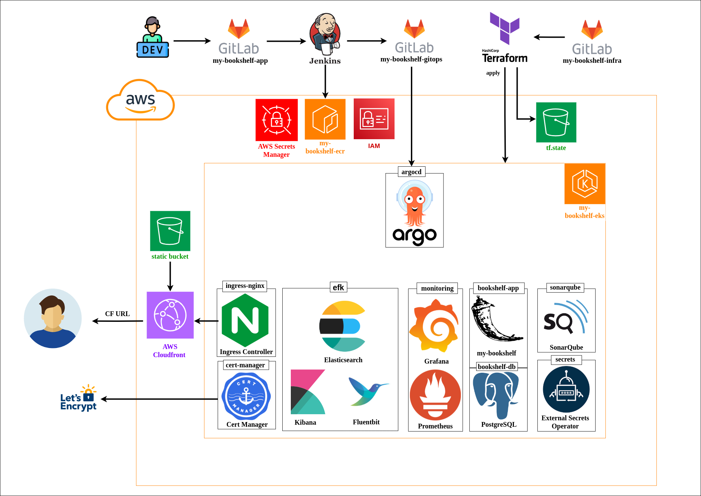

# DevOps Portfolio Project

## Overview
This portfolio project demonstrates comprehensive DevOps practices through a full-stack book management application. The project showcases modern cloud-native development, infrastructure automation, continuous deployment, and enterprise-grade monitoring solutions.

## Repositories

1. **Application** (`my-bookshelf`): Contains the full-stack application with Python Flask backend, vanilla JavaScript frontend, and comprehensive test suites.

2. **Infrastructure** (`my-bookshelf-infra`): Manages AWS cloud infrastructure using Terraform and Terragrunt, including EKS cluster provisioning, VPC networking, and IAM configurations.

3. **GitOps Configuration** (`my-bookshelf-gitops`): Implements GitOps methodology using ArgoCD for continuous deployment, featuring the App of Apps pattern for scalable application management.

## Architecture

The project follows a modern cloud-native architecture deployed on AWS:
- **Frontend**: Static files served via CloudFront CDN from S3
- **Backend**: Containerized Flask API running on EKS
- **Database**: PostgreSQL with persistent storage
- **Infrastructure**: Fully automated with Terraform/Terragrunt
- **Deployment**: GitOps-driven continuous deployment with ArgoCD

## Technology Stack

* **Terraform & Terragrunt:** Infrastructure as Code for AWS resource provisioning
* **AWS Services:** EKS, VPC, EC2, ECR, S3, CloudFront, Secrets Manager, IAM
* **Kubernetes:** Container orchestration on Amazon EKS
* **Docker:** Application containerization
* **ArgoCD:** GitOps-based continuous deployment
* **Helm:** Kubernetes package management
* **CI/CD Pipelines:** Jenkins and GitHub Actions
* **Python (Flask):** Backend API development with SQLAlchemy ORM
* **PostgreSQL:** Relational database for book data
* **NGINX Ingress Controller:** Kubernetes ingress management
* **Cert-Manager:** Automated SSL/TLS certificate management
* **External Secrets Operator:** AWS Secrets Manager integration
* **EFK Stack:** Centralized logging (Elasticsearch, Fluent Bit, Kibana)
* **Prometheus & Grafana:** Metrics collection and visualization
* **SonarQube:** Code quality and security analysis

## Key Features

- ✅ Complete infrastructure automation with Terraform modules
- ✅ Multi-environment support using Terragrunt
- ✅ Dual CI/CD pipelines (Jenkins & GitHub Actions)
- ✅ Automated testing (Unit, Integration, E2E)
- ✅ Self-healing deployments with ArgoCD
- ✅ Comprehensive observability stack
- ✅ Security best practices with IRSA and secret management
- ✅ Cost-optimized architecture (~$190/month)

## Documentation

Each repository includes detailed `README.md` files with:
- Architecture diagrams and screenshots
- Step-by-step deployment instructions
- API documentation
- Troubleshooting guides
- Best practices and design decisions

## Getting Started

1. **Infrastructure Setup**: Deploy AWS resources using Terraform/Terragrunt
2. **Application Deployment**: ArgoCD automatically syncs from GitOps repository
3. **Access Application**: https://d29uf7fg4cztcx.cloudfront.net

Detailed instructions available in each repository's documentation.

