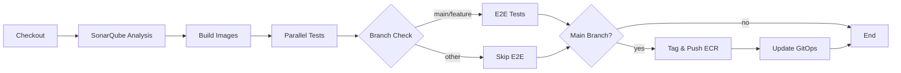

# My Bookshelf 📚

> A full-stack web application for managing your personal book collection - the main application repository featuring automated CI/CD, containerization, and comprehensive testing.

## 📋 Table of Contents

- [Overview](#overview)
- [Features](#features)
- [Tech Stack](#tech-stack)
- [Project Structure](#project-structure)
- [Prerequisites](#prerequisites)
- [Getting Started](#getting-started)
- [Testing](#testing)
- [CI/CD Pipeline](#cicd-pipeline)
- [API Reference](#api-reference)
- [Monitoring](#monitoring)
- [Related Repositories](#related-repositories)
- [Contributing](#contributing)
- [Troubleshooting](#troubleshooting)

## 🎯 Overview

My Bookshelf is the main application repository for a book management system that demonstrates modern DevOps practices. This repository contains the Flask backend API, vanilla JavaScript frontend, and Docker configurations. The application integrates with two other repositories for complete deployment:
- **my-bookshelf-gitops**: Kubernetes manifests and ArgoCD configurations
- **my-bookshelf-infra**: Infrastructure as Code (Terraform) for AWS resources

## ✨ Features

**Application Features:**
- 📖 Full CRUD operations for book management
- ⭐ Book rating system (1-5 stars)
- 📝 Personal notes for each book
- 🎨 Clean, responsive UI with a library-themed design
- 🔍 Genre categorization
- 🔄 Real-time updates without page refresh

**Technical Features:**
- 🐳 Multi-container Docker setup
- 🧪 Comprehensive test coverage (unit, integration, E2E)
- 📊 Code quality analysis with SonarQube
- 📈 Prometheus metrics for monitoring
- 🔔 Slack notifications for CI/CD events
- 🏷️ Automated semantic versioning
- 📦 Container registry with AWS ECR

## 🛠️ Tech Stack

| Category | Technologies |
|----------|-------------|
| **Frontend** | HTML5, CSS3, Vanilla JavaScript, Nginx |
| **Backend** | Python 3.9, Flask, SQLAlchemy, Flask-CORS |
| **Database** | PostgreSQL 15 |
| **Containerization** | Docker, Docker Compose |
| **CI/CD** | Jenkins Pipeline |
| **Container Registry** | AWS ECR |
| **Code Quality** | SonarQube, pytest |
| **Monitoring** | Prometheus metrics, JSON structured logging |
| **Notifications** | Slack webhooks |

## 📁 Project Structure

```
my-bookshelf/
├── backend/                 # Flask API application
│   ├── app.py              # Main application file
│   ├── requirements.txt    # Python dependencies
│   └── tests/              # Test suite
│       ├── e2e_http.py    # End-to-end HTTP tests
│       ├── test_api.py    # API integration tests
│       └── test_unit.py   # Unit tests
├── frontend/               # Static web frontend
│   ├── index.html         # Main HTML page
│   ├── app.js            # JavaScript application logic
│   └── style.css         # Custom styling
├── docker/                # Docker configurations
│   ├── Dockerfile.backend # Backend container definition
│   └── Dockerfile.nginx   # Frontend container definition
├── nginx/                 # Nginx configuration
│   └── nginx.conf        # Server configuration
├── docker-compose.yml     # Multi-container orchestration
└── Jenkinsfile           # CI/CD pipeline definition
```

## 📋 Prerequisites

Before getting started, ensure you have the following installed:

- Docker Engine 20.10+
- Docker Compose 2.0+
- Git 2.25+
- Python 3.9+ (for local development)

For CI/CD pipeline:
- Jenkins server with Docker support
- AWS CLI configured
- Access to AWS ECR
- SonarQube server
- Slack webhook URL

## 🚀 Getting Started

### Local Development Setup

1. **Clone the repository**
```bash
git clone https://gitlab.com/maxopsdeveleap/my-bookshelf-app.git
cd my-bookshelf-app
```

2. **Set up environment variables**
```bash
cat > .env << EOF
POSTGRES_USER=bookuser
POSTGRES_PASSWORD=securepass123
POSTGRES_DB=bookshelf
EOF
```

3. **Build and start the application**
```bash
docker compose up -d --build
```

4. **Verify the services are running**
```bash
docker compose ps
```

Expected output:
```
NAME                     SERVICE    STATUS    PORTS
my-bookshelf-backend-1   backend    running   5000/tcp
my-bookshelf-db-1        db         running   5432/tcp
my-bookshelf-nginx-1     nginx      running   0.0.0.0:80->80/tcp
```

## 🌐 Accessing the Application

### Production Access via CloudFront

The My Bookshelf application is accessible through CloudFront CDN:
- **URL**: https://d29uf7fg4cztcx.cloudfront.net
- **Frontend**: Static files served from S3 bucket
- **API**: Backend requests routed to https://mybookshelf.ddns.net

### Frontend Architecture

The frontend is deployed separately from the backend:
1. **Static files** (HTML, CSS, JS) are manually uploaded to an S3 bucket
2. **CloudFront** serves these files globally with caching
3. **API routing** is handled in `app.js`:
   ```javascript
   const API_BASE_URL = (() => {
     if (window.location.hostname === 'localhost' || window.location.hostname === '127.0.0.1') {
       return ''; // Relative URLs for dev
     }
     return 'https://mybookshelf.ddns.net'; // Production API URL
   })();
   ```

This architecture provides:
- Fast global content delivery
- Separation of frontend and backend
- Cost-effective static hosting
- Direct API communication from browser to backend

### Local Development Access

The database schema is automatically created on first run. To reset the database:

```bash
docker compose down -v
docker compose up -d
```

## 🧪 Testing

The project includes comprehensive testing at multiple levels:

### Running Tests Locally

1. **Unit Tests** - Test business logic in isolation
```bash
docker run --rm -e PYTHONPATH=/app \
  -v $(pwd)/backend:/app \
  backend:latest python -m pytest tests/test_unit.py -v
```

2. **Integration Tests** - Test API endpoints with in-memory database
```bash
docker compose exec backend python -m pytest tests/test_api.py -v
```

3. **End-to-End Tests** - Test complete user workflows
```bash
docker compose exec backend python tests/e2e_http.py
```

### Test Coverage

- **Unit tests**: Core business logic, book CRUD operations
- **Integration tests**: Flask routes, database transactions
- **E2E tests**: Complete HTTP workflows, health checks

## 🔄 CI/CD Pipeline

The Jenkins pipeline automates the entire build, test, and deployment process:



### Pipeline Stages

1. **Checkout** - Pull latest code from GitLab
2. **SonarQube Analysis** - Code quality and security scanning
   - Quality gate enforcement
   - Coverage reports
3. **Build Docker Images** - Create optimized containers
4. **Parallel Testing**
   - Unit Tests (isolated)
   - Integration Tests (API level)
5. **E2E & API Tests** - Full stack testing (main/feature branches only)
6. **Tag & Push to ECR** - Semantic versioning and registry upload
   - `MAJOR:` in commit → v2.0.0
   - `MINOR:` in commit → v1.1.0
   - Default → v1.0.1 (patch)
7. **Deploy** - Trigger GitOps update in my-bookshelf-gitops

### Build Notifications

Slack notifications include:
- ✅ Success: Test results, build time, version tag, Jenkins build URL, SonarQube report link
- ❌ Failure: Error details, failed stage, Jenkins build URL, SonarQube report link

## 📡 API Reference

### Endpoints

| Method | Endpoint | Description | Request Body |
|--------|----------|-------------|--------------|
| GET | `/books` | List all books | - |
| POST | `/books` | Add a new book | `{title, author, genre?, rating?, note?}` |
| PUT | `/books/{id}` | Update a book | `{title?, author?, genre?, rating?, note?}` |
| DELETE | `/books/{id}` | Delete a book | - |
| GET | `/health` | Health check | - |
| GET | `/readyz` | Readiness probe | - |
| GET | `/livez` | Liveness probe | - |
| GET | `/metrics` | Prometheus metrics | - |

### Example Requests

**Add a book:**
```bash
curl -X POST http://localhost:5000/books \
  -H "Content-Type: application/json" \
  -d '{
    "title": "The DevOps Handbook",
    "author": "Gene Kim",
    "genre": "Technology",
    "rating": 5,
    "note": "Excellent resource for DevOps practices"
  }'
```

**Get all books:**
```bash
curl http://localhost:5000/books
```

**Update a book:**
```bash
curl -X PUT http://localhost:5000/books/1 \
  -H "Content-Type: application/json" \
  -d '{"rating": 4, "note": "Good but a bit outdated"}'
```

## 📊 Monitoring

### Prometheus Metrics

Available at `/metrics`:
- `http_requests_total` - Request count by method, endpoint, status
- `http_request_duration_seconds` - Response time histogram
- Default Flask metrics

### Structured Logging

JSON formatted logs for better observability:
```json
{
  "timestamp": "2025-01-15T10:30:45Z",
  "level": "INFO",
  "message": "Request completed",
  "module": "app",
  "funcName": "get_books",
  "method": "GET",
  "path": "/books"
}
```

## 🔗 Related Repositories

This application requires two additional repositories for complete deployment:

### my-bookshelf-gitops
- Kubernetes manifests (Deployment, Service, Ingress)
- ArgoCD application definitions
- Helm charts for the application
- Environment-specific configurations

### my-bookshelf-infra
- Terraform modules for AWS infrastructure
- EKS cluster configuration
- RDS PostgreSQL setup
- S3 buckets for Terraform state
- ECR repository definitions

## 🤝 Contributing

1. Fork the repository
2. Create a feature branch (`git checkout -b feature/amazing-feature`)
3. Commit with semantic prefix:
   - `MAJOR:` for breaking changes
   - `MINOR:` for new features
   - No prefix for bug fixes
4. Push to the branch (`git push origin feature/amazing-feature`)
5. Open a Pull Request

### Development Guidelines

- Write tests for new features
- Ensure SonarQube quality gate passes
- Update API documentation
- Follow Python PEP 8 style guide

## 🔧 Troubleshooting

### Common Issues

**Database connection errors:**
```bash
# Check database status
docker compose ps db
docker compose logs db

# Verify credentials
docker compose exec backend env | grep DATABASE_URL
```

**Frontend not loading:**
```bash
# Check nginx logs
docker compose logs nginx

# Verify static files
docker compose exec nginx ls -la /usr/share/nginx/html
```

**Tests failing locally:**
```bash
# Clean environment
docker compose down -v
docker system prune -f

# Rebuild from scratch
docker compose build --no-cache
docker compose up -d
```

**Port conflicts:**
```bash
# Check if ports are in use
lsof -i :80
lsof -i :5000

# Use alternative ports
NGINX_PORT=8080 docker compose up -d
```

---

**Project Maintainer:** Max Develeap  
**Email:** max@develeap.com  
**Repository:** [GitLab - my-bookshelf-app](https://gitlab.com/maxopsdeveleap/my-bookshelf-app)
